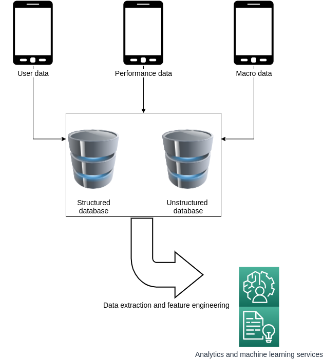
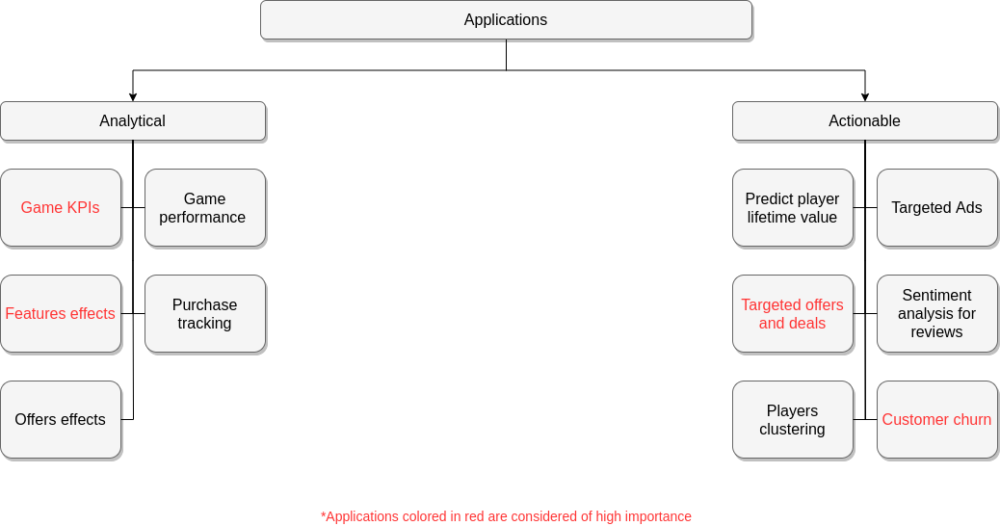

# Data science in gaming industry

## Introduction

This repository is my attempt to show why I am a good fit for the senior data scientist position by:

- Discussing possible applications using data science in Kolibri games
- Give a demo for one of the problems that can be solved using machine learning with real life example data

While Koilbri games may already be working on some or all of the proposed applications, the purpose here is to demonstrate my own:

- Research skills
- Creativity
- Data science/Machine learning skills
- Software development skills
- Huge interest in working in Kolibri games as a new and exciting challenge for me

I hope this would give you the opportunity to know me better than a cover letter or an assigned task.

-----------------------------------------------------------------

## Data sources

We can split the data sources in gaming industry into three groups:

- User/player data (play logs, purchases, events, etc...)
- Performance data (game logs, crash down data, etc...)
- Macro data (play store stats, reviews)

Different data sources are stored in the proper databases (structured/unstructured), based on the datatype. The data is passed through data extraction and feature engineering pipelines before being used in any of the data science dependent applications.

-----------------------------------------------------------------

## Applications

It is safe to assume that applications dependent on data may fall into one of the two categories:

- Analytical applications: give insights into the business 
- Actionable applications: give recommendations and actions to act upon 

Some of these applications are illustrated in the following chart.

### Analytical applications:

1. **Game KPIs**

    Monitor on a daily basis the important KPIs such as number of downloads, average play time and number of new users, etc...

2. **Game performance**

    Monitor the actual performance of the game, any unexpected crash down or similar events.

3. **Features effects**

    Track the effect of new/existing features in terms of players engagement and effect on overall KPIs as an example.
 
4. **Purchase tracking**

    Tracking of the current purchases inside the game and definition on new KPIs to monitor.

5. **Offers effects**

    Track the effect of new/existing offers in terms of players engagement and effect on overall KPIs as an example.

### Actionable applications:

1. **Predict player lifetime value**

    Build machine learning models to predict how much revenue could be expected from a certain player.
    
2. **Targeted Ads**

    Build models to start giving certain Ads to certain customers which should increase convergence rate.

3. **Targeted offers and deals**

    Instead of general offers, the system sends specific offers and deals based on the player current behaviour and probability of leaving the game permanently (customer churn). This should keep the player engaged even for a longer time by giving him/her what he/she wants.
 
4. **Sentiment analysis for reviews**

    Given the huge number of players, going manually through all the reviews on the play store becomes harder after some time: sentiment analysis models can help by going through the reviews to determine if they are positive or negative and much more.  

5. **Players clustering**

    Clustering similar players together based on their behaviour/features; such product is helpful for other products such as **[targeted offers and deals]** and **[targeted Ads]** to name a few. 

6. **Customer churn**

    Predict the probability of a player to stop playing the game for good within a certain time frame.

-----------------------------------------------------------------

## Demo

In this repo I have decided to make a demo about one of the proposed applications **[customer churn]**. This is one of the most important problems a company may face and that's why knowing that a customer may leave and act accordingly is undoubtedly valuable. To make this demo is as meaningful as possible I used real life data from an android game called **Dodge the Mud**. It is a casual action game on Android. In the game, a player dodges mud coming down from the sky by touching buttons on the phone screen or tilting the phone; the player receives scores, which are proportional to the number of muds the player dodges. The data set covers the time period from 2015 to 2016 and contains around 153K game records for around 20K players. 

The raw data along with some general guide lines for solving this problem were obtained from the following [research article](https://doi.org/10.1371/journal.pone.0180735).

The demo can be found under **customerChurn/** subdirectory and contains the following:

- [experiment.ipynb](./customerChurn/experiment.ipynb): Jupyter notebook containing the full experiment 
- [experiment.pdf](./customerChurn/experiment.pdf): PDF version of the experiment for viewing without running the code 
- requirements.txt: contains the required modules to run the experiment 
- resources/: subdirectory containing raw data and cached data through the experiment 
- auto_design/: custom made module for building full machine learning pipelines 